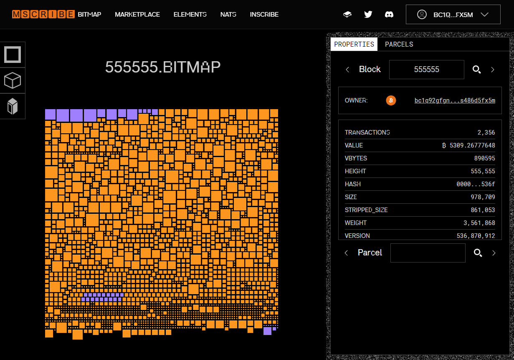

# Bitmap District #555555

Welcome to the official repository for the #Bitmap #District5 community. No tall tales or grand promises here—just a cool district name and the real shot at being part of something new. Together, we’re stepping into the world of Bitmap to see what’s in store.

## Where to Purchase

All my parcels are inscribed and tapped before they put on sale on Magic Eden. You can use the following link to make a purchase:

- [Magic Eden Marketplace](https://magiceden.io/ordinals/wallet?walletAddress=bc1q92gfgnatumqn0ly5dsd3ufzehxk7s486d5fx5m)

To verify the status of any parcel, check out:

- [Bitmap Land Verification](https://bitmap.land/?block=555555)

Please be cautious when considering purchases from other sources, as they may be untapped and, consequently, not officially recognized.

## How to Score a Free Parcel

Eager for a slice of #District5? Follow these simple steps:

1. **Follow Bitpup on Twitter**: [@bitpup555555](https://twitter.com/bitpup555555)
2. **Retweet the promotional tweets**.
3. **Reply with your BTC address** to the promotional tweets.

Your participation could lead to you owning a virtual parcel in #District5. Keep an eye on the Twitter feed for announcements and opportunities.

Grab this chance to join #Bitmap's #District5 (#555555) and let’s see what we can make of it together!

## How does my parcel look like

You can find your parcel in the district using [Mscribe](https://mscribe.io/block/555555). You can see all features related to your parcel, just make sure that the parcel you are planning to purchase is violet color (tapped).

