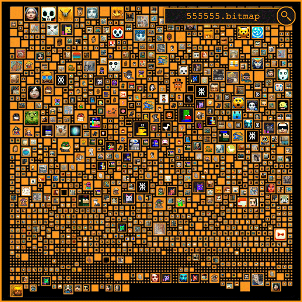

# Welcome to Bitmap District5 on Bitmaps

Bitmap District5 on the BTC blockchain serves as the "Million Dollar Homepage" for inscription OGs, gallery owners, traders, influencers, and bitmap enthusiasts. This document outlines the vision and operational details of the Orange Pages, a new standard for bitmap use and presentation. Each bitmap serves not only as a visual display but also functions as an interactive gateway, linking to various applications and enhancing community engagement within the blockchain ecosystem.

## Orange Pages - Vision

Orange Pages serves as a reference to the Yellow Pages but on the Bitcoin blockchain. Every parcel on bitmap can reference an inscribed image and include markdown text. There are various use cases for each bitmap:

- **Communities**: Like District5, bitmaps can foster vibrant communities.
- **Galleries**: Owners can host galleries showcasing on-chain inscribed art.
- **Class Photo Albums**: Digital albums to preserve and share collective memories.
- **Personal Memories**: Capture and preserve significant personal memories for future generations.
- **Art Showcases**: Reference high-resolution art stored off-chain.
- **Educational Portals**: Serve as entry points to educational content hosted off-chain.
- **Historical Records**: Index historical records, directing to archives stored off-chain.
- **Directory Services**: Act as on-chain directories with basic business details or link to detailed external directories for more comprehensive information.
- **Virtual Real Estate Displays**: Showcase virtual properties with concise descriptions and links to detailed interactive tours.
- **E-commerce Gateways**: Facilitate connections to e-commerce platforms.

### Owner Control and Curation

As a bitmap owner, you have the flexibility to set up each parcel to your liking without the need to parcelize your bitmap, thereby controlling how your digital space is utilized. However, if you wish to engage more with the community, you can choose to parcelize to foster greater interaction and collaboration. You dictate your bitmap's purpose and style by setting up title, description, and guide rules, choosing tags, and selecting the presentation style. Although some may disagree, I believe bitmap owners should be able to override vacant parcels or correct poorly made decisions by malicious actors who do not follow the guidelines set by the bitmap's owner. Some bitmaps will be curated tightly, while others may offer more freedom. In some cases, an owner may decide to 'burn' (transfer to a non-existing address) their bitmap after parcel distribution, effectively granting total freedom over the content.

### Data Storage

Not all information needs to be persistent on the blockchain. Depending on the nature of your bitmap's use case, you can choose where and how to store your data. For frequently changing information, it may be more practical not to store such data on the blockchain, optimizing both costs and performance.

### Visualization Matters

The visual presentation of bitmaps is crucial. I find the bitmap visualizations on some platforms like Magic Eden to be messy. In my presentations, I use [mscribe.io](https://mscribe.io/block/555555) for a cleaner look. In the Orange Pages, it should be up to the bitmap owner to decide how their bitmap is displayed. I appreciate platforms like bitfeed [bitfeed.live](https://bitfeed.live/block/height/555555), which offer choices in presentation based on value or vbytes. We could expand this flexibility by allowing bitmap owners to choose from a variety of parcel sizes or even standardize all blocks to be of equal size if the owner decides. A simple json child inscription to a bitmap could facilitate this customization, ensuring that each bitmap can be tailored to meet the specific aesthetic or functional needs of the owner.

### Integration with SNS

Looking toward future growth, integrating a name service to replace numerical identifiers with more user-friendly names like btc/sats/unisat can significantly enhance user accessibility. While this modernization offers substantial benefits, it's crucial to implement such changes cautiously to avoid disadvantaging early adopters, who are foundational to a project's success. Careful planning and phased integration are essential to ensure that innovations enhance the platform without undermining the contributions of those who supported bitmaps from the beginning.

### Platform Development

The envisioned platform does not yet exist, but there is no inherent reason why it couldn't be realized. The project is not overly complex, and if I succeed with my District5 vision, I will seek partners with the necessary experience to develop it. 

On the presentation side, I have used avatars of a few famous influencers for visualization purposes only; there are no official partnerships at the time of writing this document. If using these images has offended anyone, please let me know, and I will remove them immediately.

## District5 - Vision

District5 is intended to be one of the potential pages within the Orange Pages, aimed at consolidating early pioneers in the bitmap space. The goal is to allocate at least 1,000 parcels to those most deserving of recognition for their contributions, with additional parcels available to others who demonstrate interest and commitment to the vision. Beyond the Orange Pages, as Bitmap adoption expands and capabilities for developing virtual properties on bitmap parcels evolve, imagine all the notable OGs establishing their properties in the same district. This vision is the essence of District5, creating a unified hub where influential figures and pioneers can collaborate and build a shared virtual space.

District5 serves as a practical demonstration within the Orange Pages, illustrating that bitmaps can be more than digital collectibles—they can be dynamic tools for community building and practical utility. If this initiative isn't advanced by me, it is conceivable that someone else will recognize its potential and undertake a similar project.

### Significance of Bitmap 555555

The choice of bitmap 555555 is strategic; its memorable number makes it an ideal example for this initiative. Should bitmaps become mainstream, I believe that practical features such as the parcel count and ease of memorization will be more valued than the rarity or artistic nature of the bitmaps.

### Explanation for Naming District5

The name 'District5' was chosen for bitmap 555555 due to its substantial number of parcels, totaling 2,356. This significant parcel count distinctly sets it apart from earlier bitmaps with the digit '5' that contain only one parcel each. Unlike these smaller bitmaps, 555555's large number of parcels qualifies it as a true district within the digital landscape. The following table illustrates how District5 compares to other similar bitmaps:

| Bitmap ID     | Parcels       | Qualification          |
|---------------|---------------|------------------------|
| 5.bitmap      | 1 parcel      | Cannot be a district   |
| 55.bitmap     | 1 parcel      | Cannot be a district   |
| 555.bitmap    | 1 parcel      | Cannot be a district   |
| 5555.bitmap   | 1 parcel      | Cannot be a district   |
| 55555.bitmap  | 1 parcel      | Cannot be a district   |
| 555555.bitmap | 2,356 parcels | District5 (qualifies)  |

### Distribution Strategy

In District5, the aim is not to distribute parcels widely or freely but to offer a clear vision and meaningful opportunities for involvement. This initiative isn't about pushing JPEGs or meme coins; instead, it focuses on engaging those genuinely interested in the potential and practical uses of bitmaps.

## How to Qualify for a District5 Parcel

Are you interested in being part of District5? Parcels might be offered to those who demonstrate their enthusiasm and active engagement within the community. Here’s how you can enhance your chances:

- **Follow Bitpup on Twitter**: Stay informed about all announcements by following [@bitpup555555](https://twitter.com/bitpup555555).
- **Engage with Our Community**: Participate actively by responding to tweets and engaging in discussions.
- **Demonstrate Your Commitment**: Ownership of at least one Bitmap in your wallet is necessary to show your dedication to the project.
- **Stay Alert for Announcements**: Opportunities to obtain a free parcel will be announced on Twitter, so keep an eye out.

## How to Acquire a District5 Parcel

Initially, a select number of parcels will be available for purchase. Each parcel is  inscribed and verified before being listed for sale on Magic Eden. Availability may change over time, so seize the opportunity to make a purchase using the link below:

- [Magic Eden Marketplace](https://magiceden.io/ordinals/wallet?walletAddress=bc1q92gfgnatumqn0ly5dsd3ufzehxk7s486d5fx5m)

To verify the status of any parcel, visit:

- [Bitmap Land Verification](https://bitmap.land/?block=555555)

Exercise caution when considering purchases from secondary sources, as such parcels might not be officially recognized. Refer to the updated spreadsheet linked below for a list of parcels, their current status, and inscription IDs, to confirm their authenticity when purchasing second-hand:

- [District5 Parcels](data/District5_Parcels.xlsx)

*Special thanks to [@blockamoto](https://twitter.com/blockamoto) for originating the bitmap concept and to [@TheBlockRunner](https://twitter.com/TheBlockRunner) for introducing me to the world of bitmap.*
